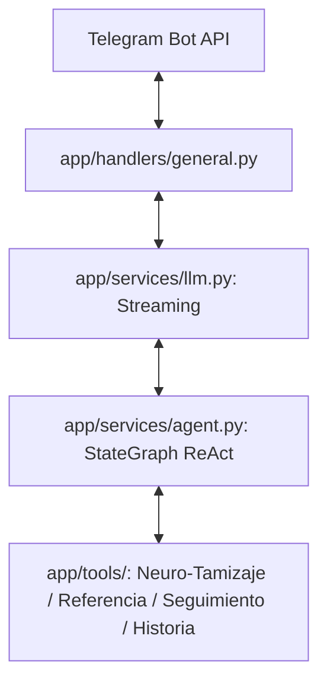

# Backend Técnico - ReLU Bot (Neuroalianza)

Documentación técnica y arquitectura de código para el backend del bot de Telegram **ReLU**.

---

## Arquitectura del Backend

El backend está construido en **Python 3.12+** utilizando una arquitectura orientada a grafos con **LangGraph** y la API de **Google Gemini** (`gemini-2.5-flash`), integrada asíncronamente con la **Telegram Bot API**.



---

## Componentes Clave del Código

| Directorio / Archivo | Función Principal |
| :--- | :--- |
| **`main.py`** | Punto de entrada del bot (FastAPI + Webhook de Telegram). |
| **`app/config.py`** | Gestión de configuración y secretos mediante `pydantic-settings`. |
| **`app/services/agent.py`** | Grafo `StateGraph` de LangGraph, memoria persistente por usuario (`MemorySaver`) y definición del System Prompt de Neuroalianza. |
| **`app/services/llm.py`** | Servicio que invoca el grafo en modo streaming (`astream`) y emite las deltas y eventos de uso de herramientas. |
| **`app/handlers/general.py`** | Manejador de eventos de Telegram. Administra las ediciones dinámicas de streaming e interacción. |
| **`app/tools/neuro_tamizaje.py`** | Herramienta `@tool` `evaluar_desarrollo_infantil` (M-CHAT-R/F, EEDP/TPED, Vanderbilt). |
| **`app/tools/neuro_referencia.py`** | Herramientas `@tool` `emitir_referencia_neurodesarrollo` y `generar_ficha_fua_neurodesarrollo`. |
| **`app/tools/seguimiento.py`** | Herramientas `@tool` `programar_seguimiento_cita` y `obtener_plan_refuerzo_hogar`. |
| **`app/tools/historia.py`** | Herramienta `@tool` `generar_resumen_caso_multidisciplinario`. |
| **`app/utils/formatter.py`** | Formateador y balanceador de sintaxis Markdown para evitar errores de renderizado en la API de Telegram. |

---

## Pruebas Automatizadas

El backend incluye una suite completa de unit tests con `pytest` y `pytest-asyncio`.

```bash
# Ejecutar todas las pruebas
uv run pytest

# Ejecutar un módulo específico
uv run pytest tests/test_neuro_tamizaje.py -v
```

---

## Contenedor Docker para Cloud Run

El archivo `Dockerfile` en este directorio compila una imagen ligera basada en `python:3.12-slim` e instala las dependencias en el sistema con `uv pip install --system`.

- **Puerto Expuesto:** `8080` (configurado mediante la variable `PORT`).
- **Comando de Ejecución:** `python main.py`.
