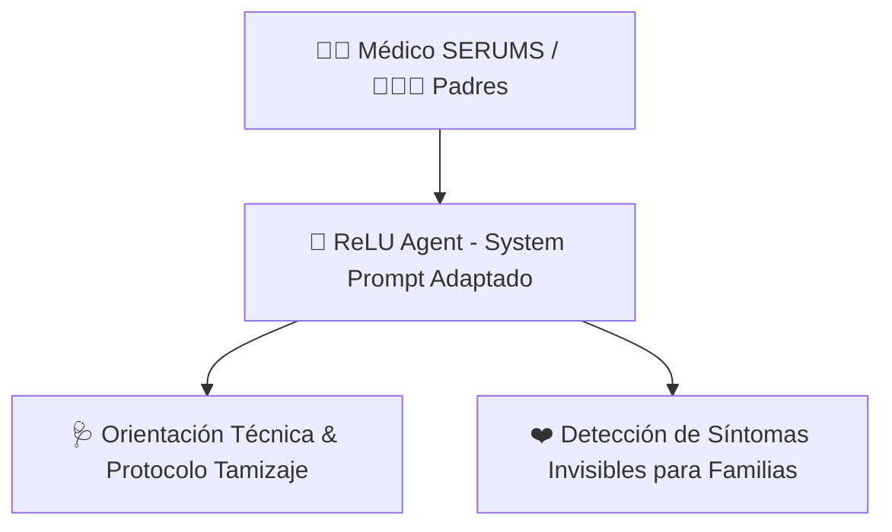

# 🫀 Cardio Alerta Perú - Asistente de Tamizaje y Tele-referencia Neonatal

Documentación de la **Fase 1: Implementación del Rol Clínico y Adaptación de Comportamiento**.

---

## 📌 Visión General del Módulo

En esta primera fase se ha adaptado el comportamiento base de **ReLU ⚡🤖** para actuar como un **Copiloto Clínico y Asistente de Tele-referencia** especializado en el tamizaje neonatal de Cardiopatías Congénitas Críticas (CCC) en colaboración con el **Instituto Nacional de Salud del Niño San Borja (INSN-SB)**.



---

## 🧠 Adaptación del System Prompt (`RELU_SYSTEM_PROMPT`)

El prompt de sistema ubicado en [app/services/agent.py](file:///home/techatlasdev/Proyectos/OculusLab/hackaton/backend/app/services/agent.py) ha sido actualizado con los siguientes pilares de comportamiento:

### 1. Atención al Personal Médico
- **Rol:** Asistente técnico de apoyo para médicos SERUMS y enfermeros en puestos/centros de salud rurales.
- **Capacidades:**
  - Guía sobre la técnica de tamizaje por oximetría diferencial (mano derecha vs. pie).
  - Orientación en la identificación de signos clínicos de sospecha (soplos cardiacos, taquipnea, pulsos disminuidos, cianosis).
  - Instrucciones para la activación de interconsultas y referencias prioritarias hacia el **INSN-SB**.

### 2. Atención a Padres y Cuidados Familiares (Detección de Síntomas Invisibles)
- **Rol:** Asistente cercano y empático para familias.
- **Capacidades:**
  - Identificación de signos de alerta "invisibles" que los padres suelen confundir con frío, gases o soroche:
    - *Fatiga excesiva o sudoración fría al lactar.*
    - *Respiración agitada o hundimiento de costillas (tiraje intercostal).*
    - *Coloración moradita o pálida en labios, lengua o uñas (cianosis).*
  - Lenguaje sencillo, directo y amigable sin generar pánico infundado.

---

## 🧪 Pruebas de Verificación

Se han verificado los cambios utilizando la suite de pruebas del backend con `pytest`:

```bash
uv run pytest tests/test_agent.py
```

- **Resultado:** 100% de tests aprobados (`12 passed`).
