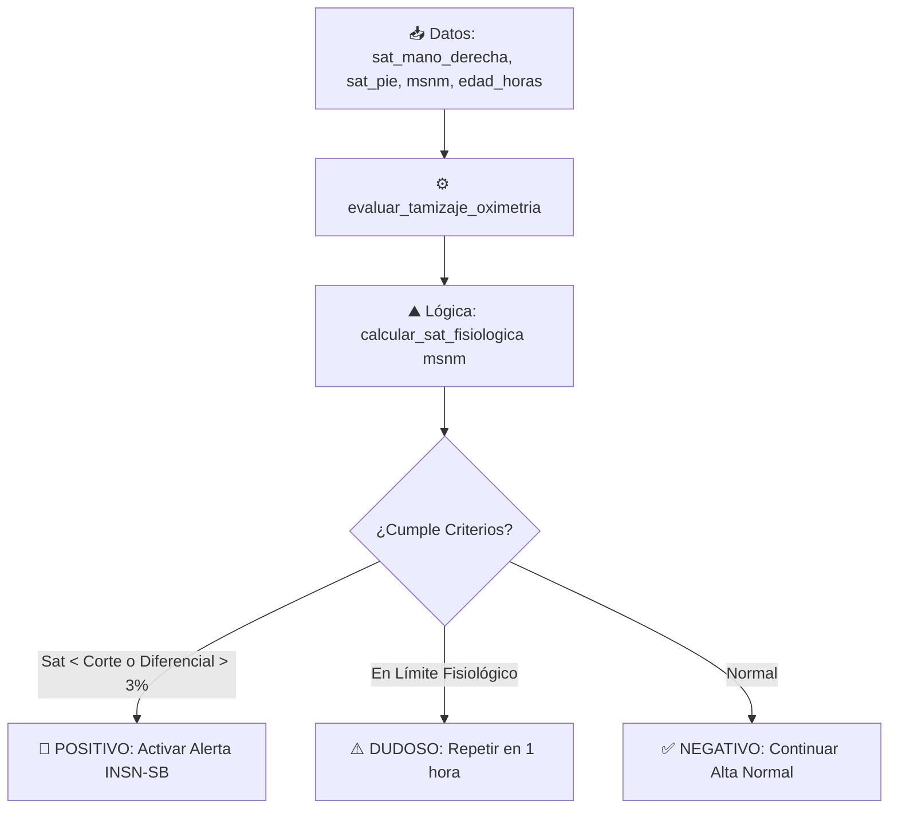

# 🫀 Cardio Alerta Perú - Asistente de Tamizaje y Tele-referencia Neonatal

Documentación de la **Fase 2: Implementación de la Herramienta de Tamizaje por Altitud (m.s.n.m.)**.

---

## 📌 Visión General del Módulo

En esta segunda fase se ha implementado la herramienta determinista `@tool` denominada **`evaluar_tamizaje_oximetria`** en [app/tools/tamizaje.py](file:///home/techatlasdev/Proyectos/OculusLab/hackaton/backend/app/tools/tamizaje.py).

Esta herramienta resuelve el **Insight 1 (Sesgo de la Altitud en el Tamizaje)**, permitiendo adaptar los umbrales de corte de la oximetría de pulso neonatal (medición pre-ductal en mano derecha y post-ductal en pie) según los metros sobre el nivel del mar (m.s.n.m.) del centro de salud de origen (ejemplo: Juliaca a 3,825 m.s.n.m. vs. Lima a 100 m.s.n.m.).

---

## ⚙️ Especificación Técnica de la Herramienta

- **Nombre:** `evaluar_tamizaje_oximetria`
- **Ubicación:** [app/tools/tamizaje.py](file:///home/techatlasdev/Proyectos/OculusLab/hackaton/backend/app/tools/tamizaje.py)
- **Registro:** [app/tools/__init__.py](file:///home/techatlasdev/Proyectos/OculusLab/hackaton/backend/app/tools/__init__.py)

### Parámetros de Entrada

| Parámetro | Tipo | Descripción |
| :--- | :--- | :--- |
| `sat_mano_derecha` | `float` | Saturación medida en la mano derecha (pre-ductal, 0-100%). |
| `sat_pie` | `float` | Saturación medida en cualquiera de los pies (post-ductal, 0-100%). |
| `msnm` | `int` | Altitud de la localidad del centro de salud en m.s.n.m. (por defecto `0`). |
| `edad_horas` | `int` | Edad del recién nacido en horas (por defecto `24`). |

---

## 🧪 Pruebas Unitarias y Cobertura

Se han integrado pruebas automatizadas en [tests/test_tamizaje.py](file:///home/techatlasdev/Proyectos/OculusLab/hackaton/backend/tests/test_tamizaje.py):

- `test_calcular_sat_fisiologica`: Valida la curva de saturación esperada en Costa (Lima), Sierra Moderada (Arequipa) y Gran Altitud (Juliaca).
- `test_evaluar_tamizaje_normal_costa`: Valida evaluación de caso negativo.
- `test_evaluar_tamizaje_positivo_juliaca_por_bajo_corte`: Valida caso positivo por saturación por debajo del rango de la altitud.
- `test_evaluar_tamizaje_positivo_por_diferencial`: Valida caso positivo por gradiente pre/post-ductal (>3%).
- `test_evaluar_tamizaje_dudoso`: Valida la recomendación de re-evaluación en 1 hora.

**Resultado de la Suite:** `17/17 passed` (100% éxito).
