# 🫀 Cardio Alerta Perú - Asistente de Tamizaje y Tele-referencia Neonatal

Documentación de la **Fase 3: Implementación de la Alerta de Interconsulta e Integración SIS/FUA**.

---

## 📌 Visión General del Módulo

En esta tercera fase se han integrado dos herramientas estratégicas `@tool` para resolver el **Insight 2 (Aislamiento del Médico Rural)** y el **Insight 4 (Papeleo Interhospitalario)**:

1. **`emitir_alerta_teleinterconsulta_insn`**: Emite una alerta de prioridad roja hacia el equipo de Cardiología Pediátrica del INSN-SB y simula la generación de un Ticket de Referencia Prioritaria.
2. **`generar_ficha_referencia_sis`**: Estructura automáticamente el borrador del Formato Único de Atención (FUA) y la Hoja de Referencia del SIS con diagnóstico presuntivo CIE-10 (`Q24.9`).

```mermaid
graph TD
    Alert[🚨 Tamizaje Positivo] --> Tool1[⚙️ emitir_alerta_teleinterconsulta_insn]
    Tool1 --> Ticket[🎟️ Generación Ticket INSN-CCC-XXXX]
    Ticket --> Directo[📞 Canal Directo de Tele-orientación Especializada]

    Alert --> Tool2[⚙️ generar_ficha_referencia_sis]
    Tool2 --> FUA[📋 Borrador FUA / SIS Auto-completado sin Burocracia]
```

---

## ⚙️ Especificación Técnica de las Herramientas

- **Ubicación:** [app/tools/referencia.py](file:///home/techatlasdev/Proyectos/OculusLab/hackaton/backend/app/tools/referencia.py)
- **Registro:** [app/tools/__init__.py](file:///home/techatlasdev/Proyectos/OculusLab/hackaton/backend/app/tools/__init__.py)

### 1. `emitir_alerta_teleinterconsulta_insn`
- **Entradas:** `nombre_paciente`, `edad_horas`, `distrito_origen`, `msnm`, `sat_mano_derecha`, `sat_pie`, `codigo_renipress`.
- **Salida:** Confirmación con ID de ticket único (`INSN-CCC-XXXXXX`), timestamp de emisión y pautas de soporte neonatal mientras se coordina la interconsulta.

### 2. `generar_ficha_referencia_sis`
- **Entradas:** `nombre_paciente`, `dni_apoderado`, `distrito_origen`, `diagnostico_presuntivo`, `resumen_clinico`.
- **Salida:** Borrador estructurado FUA/SIS con código FUA único (`FUA-XXXXXXXX`) pre-validado.

---

## 🧪 Pruebas Unitarias y Cobertura

Se han integrado pruebas automatizadas en [tests/test_referencia.py](file:///home/techatlasdev/Proyectos/OculusLab/hackaton/backend/tests/test_referencia.py):

- `test_emitir_alerta_teleinterconsulta_insn`: Verifica la emisión del ticket y datos del establecimiento de origen.
- `test_generar_ficha_referencia_sis`: Verifica el formateo del borrador FUA y código de expediente.

**Resultado de la Suite:** `19/19 passed` (100% éxito).
